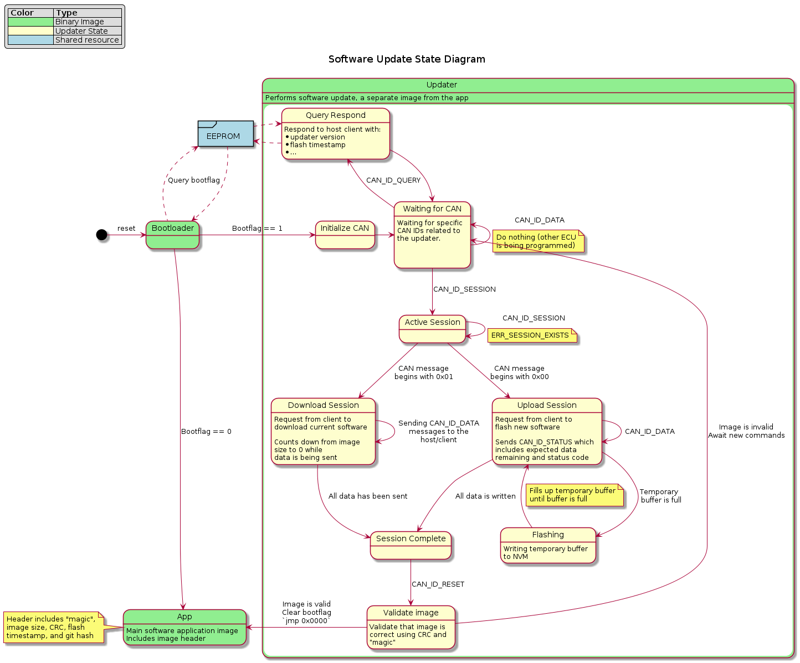

On Olin's Formula SAE team, I built a [vehicle software update
system](https://github.com/jack-greenberg/btldr) consisting
of a custom bootloader and an application protocol that uses the CAN protocol
for its physical and data-link layer.

<!--more-->

{{}}

## Features

The system, referred to as _btldr_, allows engineers to update any ECU on the
vehicle without physical access to the hardware. The bootloader is responsible
for initializing the CAN protocol stack and reacting to the commands issued by
the host. It also handles image validation by performing a cyclic-redunancy
check and refusing to run the image if corruption has occured.

The entire bootloader takes up less than 4 kilobytes of space on the
device, making it light-weight while still maintaining robustness.

## Application Protocol

The _btldr_ utilizes a custom protocol for initializing and conducting the
update. There are 4 different message types:

* __Ping__: Checks device reachability, current firmware version, and updater
  compatibility
* __Request Update__: Initialize an update session for a particular ECU
* __Data__: Contains a chunk of the binary being flashed
* __Reset__: Instructs the device to check the validity of the image and begin
  executing if it is valid

Each of these commands has an associated response message that is sent by the
target device to acknowledge and/or provide additional data to the host.

## Bootloader

The bootloader portion of the system is a 4 kilobyte program that executes
whenever the device resets. It first checks an EEPROM memory bank that is shared
with the application section to see if an update has been requested, and, if so,
initializes the protocol stack.

It then listens for specific CAN messages and acts according to the commands it
receives.

## Motivation

Historically on the Formula team, ECU firmware updates required a group of
engineers to open up various enclosures and unplug PCBs from around the car and
manually recompile and flash code using a programming dongle. This is highly
inefficient and costs valuable time to the engineers. The motivation behind this
project is to provide a streamlined method for updating vehicle firmware that
only requires a single point of physical access to the car.

## Future Steps

Many automotive OEMs are recognizing a need for over-the-air (OTA) software
updates, especially as more and more embedded systems for electric vehicles are
being introduced for things like safety and autonomy. As a learning experiment,
I hope to integrate a Wi-Fi-based OTA updater component to the vehicle, which
would allow it to be updated remotely.

With the addition of remote access comes the necessity for security. An
unsecured software update mechanism could allow malicious actors to introduce
dangerous code to a vehicle. In addition to wireless access, I also hope to
create a secure software update system which uses code-signing to verify the
integrity and origin of the code.

---

Detailed project documentation---including deep-dives into the different
technologies and methods used to build the tool---can be found
[here](https://docs.olinelectricmotorsports.com/share/01350eeb-8337-4c31-98f8-7eeb97936000).
