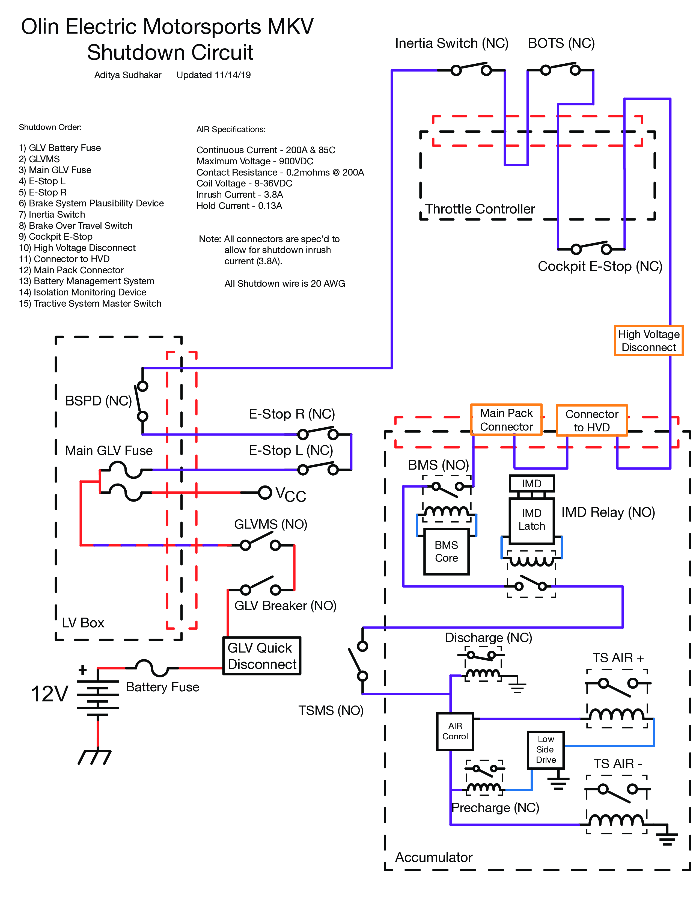

The shutdown sense board is a PCB[^1] on the [Olin Electric Motorsports](https://www.olinelectricmotorsports.com) Mark V car. It provides a helpful diagnostic interface for debugging the shutdown circuit and helps engineers quickly identify sources of failure for the car.

[^1]: Printed circuit board

## The Shutdown Circuit

The shutdown circuit is the primary safety checking circuit of the car, and runs around the entire body of the vehicle. It controls the the AIRs, or _accumultors isolation relays_, which allow high voltage (~400V nominal) from the accumulator[^2] to flow to the motor controller. However, in the circuit there is a series of nodes at which different conditions in the car could cause the circuit to open, preventing the car from driving. The different parts of the circuit (in order) are:

[^2]: Battery :battery:

1. :key: __GLVMS__: Grounded Low Voltage Master Switch (key to control low voltage)
2. :red_circle: __ESTOP Left/Right__: Emergency stop buttons on the sides of the car
3. [__BSPD  ↪__](/projects/bspd/)
4. :collision: __Inertia Switch__: aka _Crash sensor_
5. :nut_and_bolt: __BOTS__: Break-over-travel switch, which detects if the break isn't working because it is allowed to be pushed passed the hard-breaking limit
6. :red_circle: __Cockpit ESTOP__: Driver emergency stop button, aka the _oh shit_ switch
7. :electric_plug: __HVD__, __Connector to HVD__, __Main Pack Connector__: Various connectors that be used to physically isolate the accumulator from the rest of the car
8. :battery: __IMD__:  Insulation monitoring device, makes sure the high voltage and low voltage systems are isolated from each other
9. :key: __TSMS__: Tractive System Master Switch (key to control high voltage)

Here is a more detailed diagram of the shutdown circuit drafted by a previous electrical lead:

{{}}

## Monitoring the circuit

The main reason for this working on this project was to provide a simple tool for visualising the status of the shutdown circuit. The majority of the nodes are monitored on boards elsewhere on the car (usually close to the node itself). The two exceptions are the __GLVMS__ and the __Left and Right ESTOPS__. Monitoring for those happens on this board, as you can see towards the left side of the board[^3]:

[^3]: Where the thick wires lead to

{{}}

Monitoring the shutdown circuit at a node works by using a MOSFET transistor is connected to the shutdown circuit _just after the node it is monitoring_, and so if that node opens, the corresponding light will turn off, and the microcontroller on the board registers the change and sends a message to the cars CAN bus (communication network).

### Use case for the board

> Imagine seeing the car on the racetrack and it suddenly stops. There is no explosion, but there are also no more red flashes from the _tractive system active light_, which indicates that high voltage is flowing from the battery to the motor controller. Instead of manually checking each node, you can pop open the LV Box where this board is located and quickly see where the circuit opened, get the issue fixed, and get wheels spinning again.

## Looking back

This project was a lot of fun because of its simplicity. It is basically just a lot of LEDs in a row, and so it allowed for a lot of creativity in the "UX" of the board, namely for the silk screen (used for labeling on the board).

This board also taught me a lot about debugging. When we shipped the first revision of the board from the PCB manufacturer, I forgot to run the DRC, or _design rules check_, which, had it been run, would have warned me that I had some missing wires. The biggest blunder I made was forgetting to ground my microcontroller, which led to it behaving erratically. Discovering this took a lot of time combing over each part of the board with a voltmeter, and re-soldering the microcontroller _two_ times. Despite the frustrations, it did teach me a lot in the end, and it was all worth it.

Since we had to evacuate campus due to the pandemic, we never were able to ship the second revision of the board, but as soon as it is safe to do it, I am excited to receive it, hook it up to the car, and watch it do its thing.

{{}}
